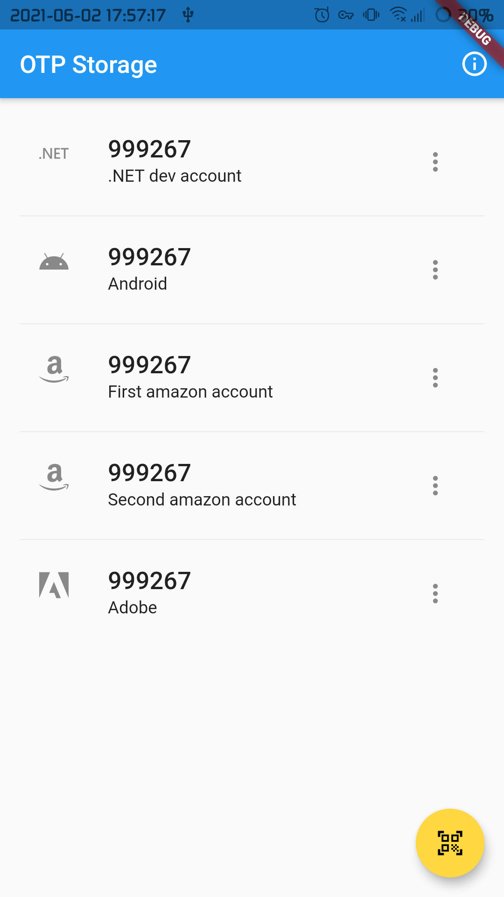
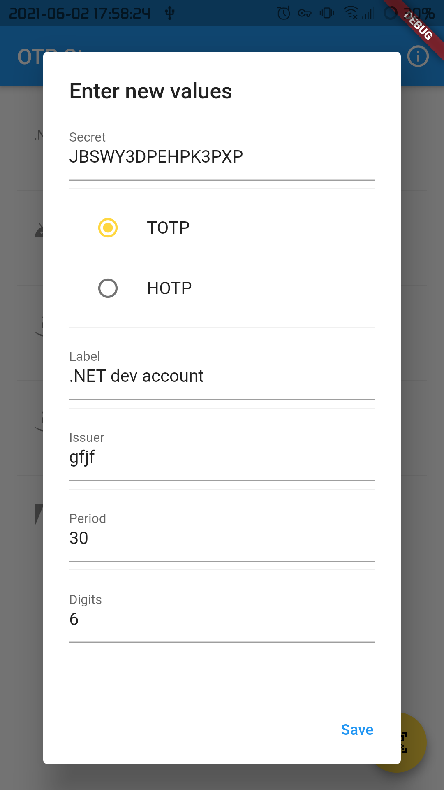
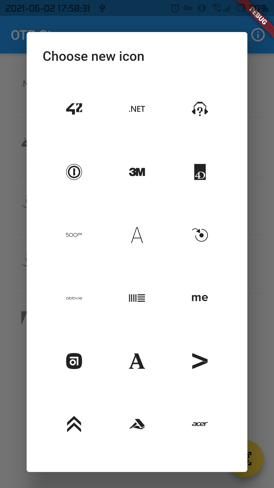
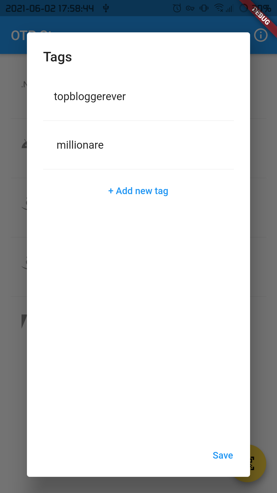

# OTP Storage

Secure storage for one-time password

- Supports both TOTP and HOTP algorithms  
- Always encrypts secrets  
- Sets icon for secret (depends on issuer)  
- Allows you to add description and tags

## Build

### Android

Follow steps to [sign your app](https://flutter.dev/docs/deployment/android#signing-the-app)

#### Linux CLI

Run:  
``` shell script
git clone https://github.com/kirillmokretsov/otp_storage.git
cd otp_storage
flutter pub get 
flutter build apk --no-tree-shake-icons
```

Now you can get apk in ``build/app/outputs/flutter-apk/app-release.apk``

## Screenshots









## License

Source code available under [GNU GENERAL PUBLIC LICENSE](https://www.gnu.org/licenses).
